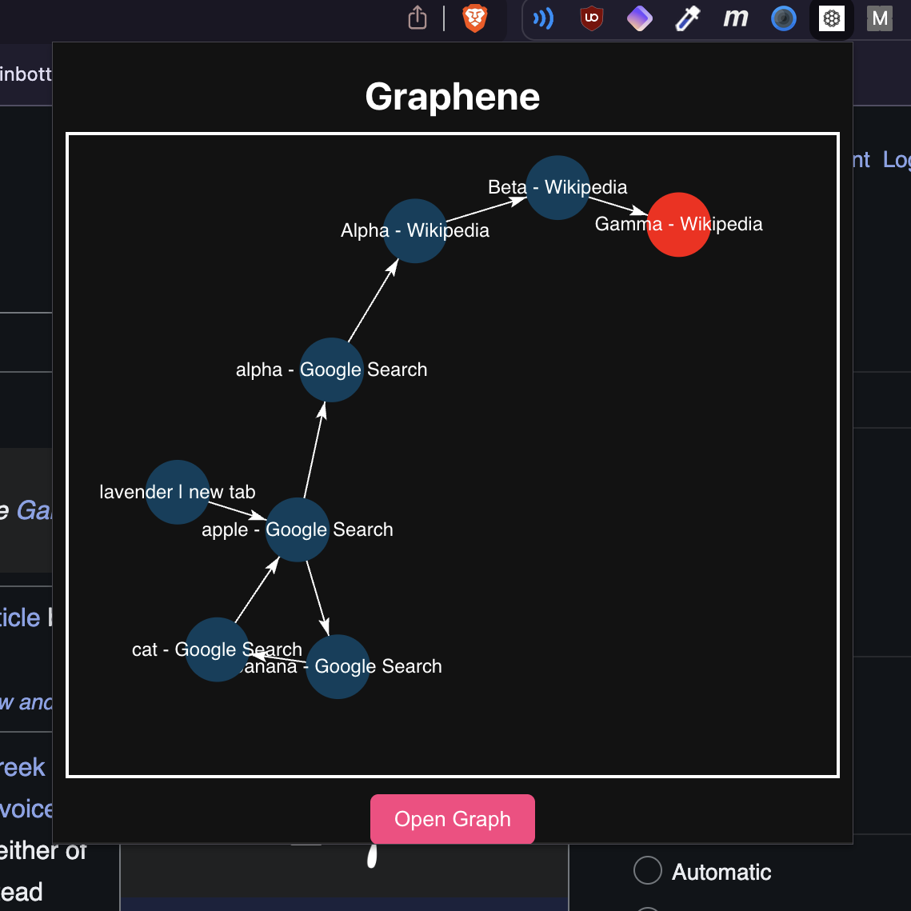

# Graphene

Visualize your search history as a **directed graph**, adapted from [OpenFiche](https://github.com/swefton/openfiche).
Graphene turns your browsing history into an interactive graph, helping you see how your searches connect and evolve.

---

## Features

* View your search history as a **graph of connected queries**
* Explore relationships between searches visually
* Simple Chromium extension setup

---

## Screenshots

### Popup View



---

## Development Setup

1. **Install Node.js**
   Download and install [Node.js](https://nodejs.org/en/download).

2. **Clone the repository**

   ```bash
   git clone https://github.com/your-username/graphene.git
   cd graphene
   ```

3. **Install dependencies**

   ```bash
   npm install
   ```

4. **Build the extension**

   ```bash
   npm run build
   ```

   This creates a `dist/` folder with the build.

5. **Load in Chromium**

   * Open your Chromium-based browser (Chrome, Brave, Edge, etc.)
   * Navigate to `chrome://extensions`
   * Enable **Developer Mode**
   * Click **Load Unpacked** and select the generated `dist/` folder

---

## Roadmap
- Official release on the chrome webstore
- Sync across devices


## License

MIT License © 2025